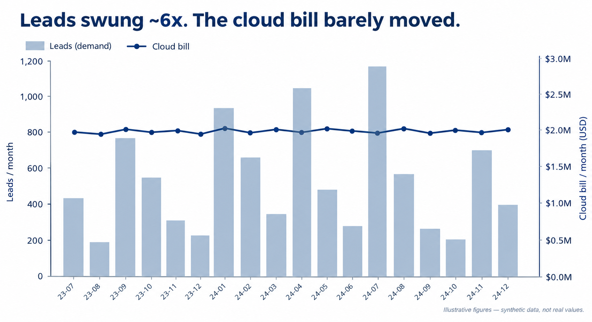
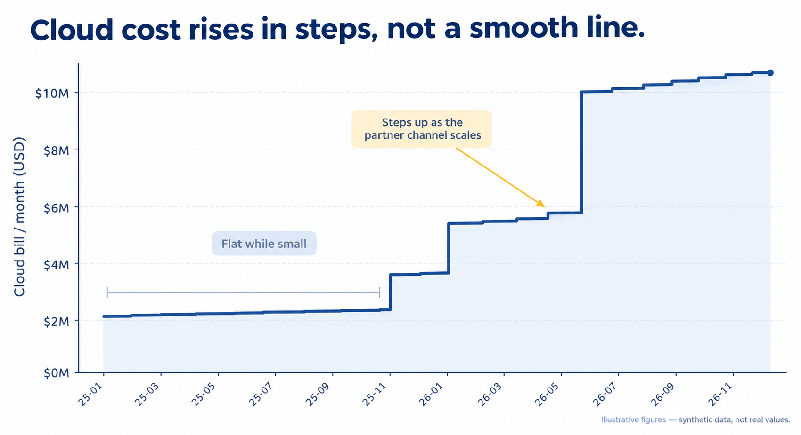
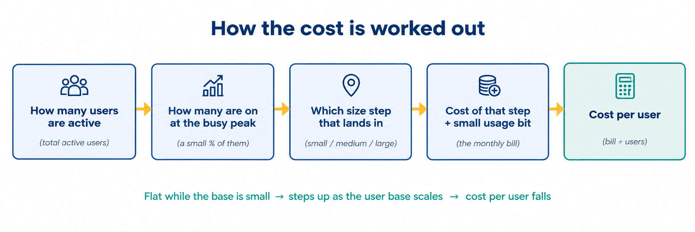
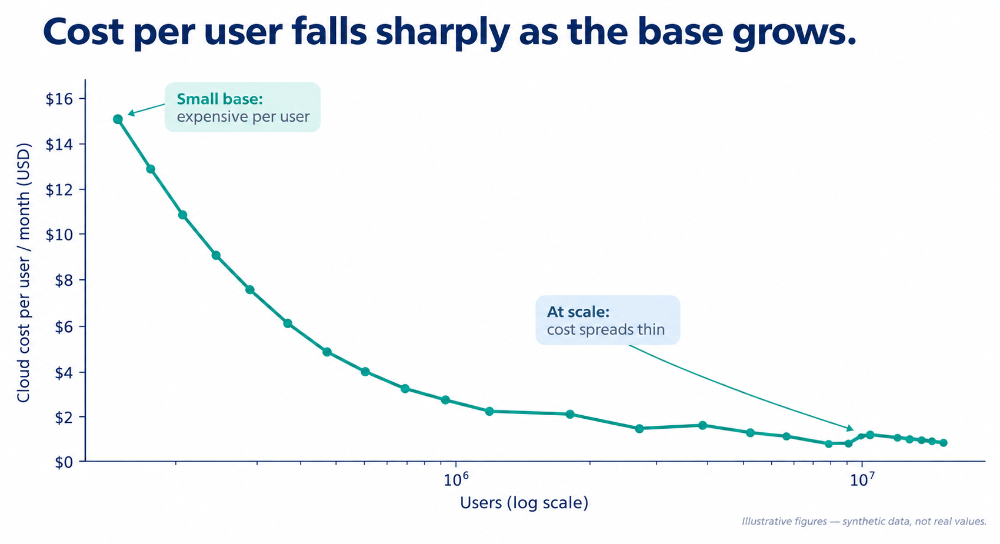

# Forecasting cloud infrastructure costs at scale

*A short case study on forecasting cloud costs. The interesting part wasn't the model — it was finding that the obvious approach, where cost scales with demand, was wrong, and rebuilding the forecast around how infrastructure cost actually behaves: in steps, not a smooth line.*

---

I wanted to understand how cloud infrastructure costs would change as usage grew.

The obvious idea was to link the cloud bill to demand — leads, enrolments, revenue — and forecast from there. Before building anything on that, I checked whether the historical data actually backed it up.

## What I found

I compared the monthly cloud bill with the main demand metrics.

Demand changed significantly from month to month, but the cloud bill stayed relatively flat. When I looked at the cost breakdown, most of the bill was fixed: servers, databases, storage, and other infrastructure that was running regardless of how many users were active.

Only a smaller part of the cost changed with usage.

So a simple cost-per-user model would not have matched the way the cost was actually behaving.

## The model

The main thing I found was that infrastructure cost increases in steps rather than moving up smoothly with demand.

The setup can support a larger number of users without much change in cost. Once it reaches its capacity, additional infrastructure is needed and the cost jumps to the next level.

I built the forecast around this behaviour: it works out how much infrastructure each level of usage needs and prices that, so the forecast stays flat until more capacity is required, then steps up.

The detailed methodology is in [**model/method.md**](model/method.md).

## Cost per user

The same model also shows why cost per user changes with scale.

For example, with a fixed monthly cost of $20,000:

|     Users | Cost per user |
| --------: | ------------: |
|    20,000 |         $1.00 |
|   200,000 |         $0.10 |
| 2,000,000 |         $0.01 |

The total cost stays the same in this example. The cost per user falls because the fixed cost is spread across more users.

## What this shows

- I tested the initial idea against the data before building on it, and found it didn't hold.
- The data was allowed to override the intuition: "more users, more cost" seemed reasonable, but the history showed otherwise.
- The forecast was built around how the cost actually behaves, so it shows when the larger cost increases happen rather than a line drifting up.

## Data

**No real data is used in this case study.** The dataset is fully synthetic — the numbers are invented, and only the *pattern* of cost behaviour is designed to be realistic. It is not based on any company's actual data or cloud bill.
